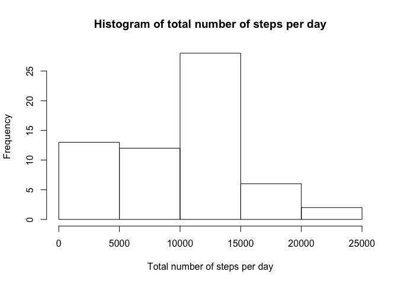
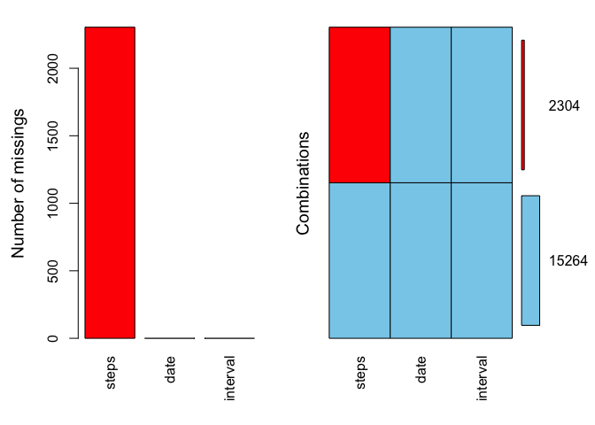
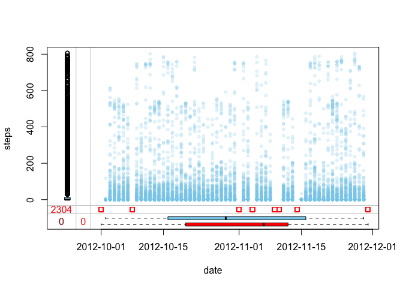
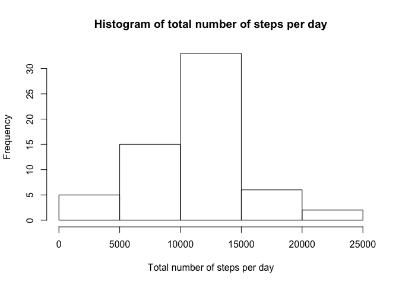
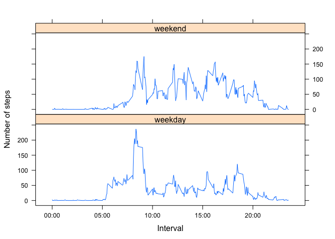

# Reproducible Research: Peer Assessment 1
  
  
  
## Loading and preprocessing the data


```r
df <- read.csv("activity.csv",stringsAsFactors = F)
df$date <- as.Date(df$date, "%Y-%m-%d")

oldlocale <- Sys.getlocale(category = "LC_TIME")
Sys.setlocale("LC_TIME", "en_US.UTF-8")
```
  
  
  
## What is mean total number of steps taken per day?


```r
require(dplyr)

totstepsday <- df %>% group_by(date) %>% summarise(tot = sum(steps, na.rm = T)) %>% select(tot)
hist(totstepsday$tot, main = "Histogram of total number of steps per day", xlab = "Total number of steps per day")
```

 

```r
origmean <- mean(totstepsday$tot)
origmedian <- median(totstepsday$tot)

tbl <- cbind(values = c(origmean, origmedian))
rownames(tbl) <- c("mean", "median")
```

The mean and median values of the total number of steps taken per day are shown in the following table:


```r
require(pander)

pander(tbl, style = "rmarkdown")
```


|    &nbsp;    |  values  |
|:------------:|:--------:|
|   **mean**   |   9354   |
|  **median**  |  10395   |

  
  
  
## What is the average daily activity pattern?


```r
daily <- df %>% group_by(interval) %>% summarise(mn = mean(steps, na.rm = T))
plot(daily, type = "l", main = "Average number of steps per 5-minutes inverval", xaxt = "n", ylab = "Average number of steps")
axis(side = 1, at = c(0, 500, 1000, 1500, 2000), labels = c("00:00", "05:00", "10:00", "15:00", "20:00"))
```

 

```r
intvMaxSteps <- as.numeric(daily[which.max(daily$mn),"interval"])
```

The 5-minute interval which contains the maximum number of steps (on average across all the days in the dataset) is the **835** interval.
  
  
  
## Imputing missing values
  
  
### Visual analysis of missing data

The following plot identifies the variables which contain NAs (missing data).


```r
library(VIM)

miss <- aggr(df, prop = F, numbers = T)
```

 

```r
missval <- miss$missings$Count[miss$missings$Variable == "steps"]
```

Total number of missing values in the dataset is **2304** and missing data affects only `steps` variable. 

The following scatterplot permits visual analysis of missing `steps` values versus `date` variable.

```r
marginplot(df[c("date", "steps")], pch = c(20,0), numbers = T, xaxt = "n", alpha = .2)
axis.Date(side = 1, x = df$date, format = "%Y-%m-%d")
```

 

Red squares on the x axis margin indicate dates for which there are missing `steps` values. It can be seen that for the days with missing `steps` values there are no measurements available (no blue dots), so the algorithm for imputing missing values must do so for all intervals for the 8 days with missing values.
  
  
### Missing Data Imputation

The method chosen is to identify the day of the week for the days where the steps are missing and substitute their data with the average of the other days of the same week day. This is based on the assumption that usually there is a pattern in a day planning and activities of a person depending on the day of the week. (This assumption can be of course verified by calculating the relevant correlations, but this is not done here in order to keep it simple.)


```r
df2 <- df
nas <- df2 %>% group_by(date) %>% summarise(nas = sum(is.na(steps)))
nasdates <- nas[nas$nas > 0,]$date
imp <- df %>% group_by(weekdays(date), interval) %>% summarise(steps = mean(steps, na.rm = T))
imp <- as.data.frame(imp)        # simplify the structure
imp <- split(imp, imp$`weekdays(date)`)
for(wd in seq_along(nasdates)) {
    df2[df2$date == nasdates[wd],]$steps <- imp[[weekdays(nasdates[wd])]]$steps
}

totstepsday2 <- df2 %>% group_by(date) %>% summarise(tot = sum(steps)) %>% select(tot)
hist(totstepsday2$tot, main = "Histogram of total number of steps per day", xlab = "Total number of steps per day")
```

 

Comparing this histogram to the one generated for data set containing missing values it can be seen that the most significant difference is in the first bin (0-5000 steps per day). Knowing how the missing values affect the dataset (missing number of steps for the whole day) it is obvious, that after imputing data for those days the number of days (frequency) with low (in particular with 0) total number of steps will decrease.

Imputing missing values increases both the mean and the median of the total daily number of steps, although the median to a lesser degree. Values before and after imputting can be seen in the following table:


```r
newmean <- mean(totstepsday2$tot)
newmedian <- median(totstepsday2$tot)

tbl2 <- cbind(cbind(mean = c(origmean,newmean)), cbind(median = c(origmedian, newmedian)))
rownames(tbl2) <- c("Data with missing values", "Data with imputed values")
pander(tbl2, style = "rmarkdown")
```


|             &nbsp;             |  mean  |  median  |
|:------------------------------:|:------:|:--------:|
|  **Data with missing values**  |  9354  |  10395   |
|  **Data with imputed values**  | 10821  |  11015   |

  
  
  
## Are there differences in activity patterns between weekdays and weekends?


```r
require(lattice)

df2 <- df2 %>% mutate(wkd = factor(ifelse(weekdays(df2$date, abbreviate = T) == "Sat" | weekdays(df2$date, abbreviate = T) == "Sun", "weekend", "weekday"), levels = c("weekday","weekend"), labels = c("weekday","weekend")))
wkdavg <- df2 %>% group_by(wkd, interval) %>% summarise(wkdavg = mean(steps))
xyplot(wkdavg~interval|wkd, data = wkdavg, type = "l", layout = c(1,2), ylab = "Number of steps", xlab = "Interval", scales = list(x = list(at = c(0, 500, 1000, 1500, 2000), labels = c("00:00", "05:00", "10:00", "15:00", "20:00"))))
```

 


```r
# Restore the original locale
Sys.setlocale("LC_TIME", oldlocale)
```
