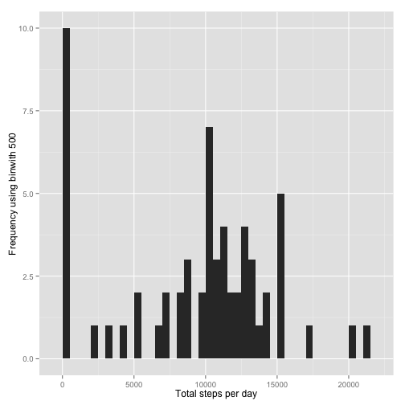

#Reproducible Research: Peer Assessment 1


```r
library(ggplot2)
library(scales)
library(Hmisc)
```

```
## Loading required package: grid
## Loading required package: lattice
## Loading required package: survival
## Loading required package: Formula
## 
## Attaching package: 'Hmisc'
## 
## Następujące obiekty zostały zakryte z 'package:base':
## 
##     format.pval, round.POSIXt, trunc.POSIXt, units
```

###Loading and preprocessing the data

####1. Load the data (i.e. read.csv())

```r
if(!file.exists('activity.csv')){
    unzip('activity.zip')
}
activityData <- read.csv('activity.csv')
```
####2. Process/transform the data (if necessary) into a format suitable for your analysis

```r
#activityData$interval <- strptime(gsub("([0-9]{1,2})([0-9]{2})", "\\1:\\2", activityData$interval), format='%H:%M')
```
###What is mean total number of steps taken per day?

```r
stepsByDay <- tapply(activityData$steps, activityData$date, sum, na.rm=TRUE)
```
####1. Make a histogram of the total number of steps taken each day

```r
 qplot(stepsByDay, xlab='Total steps per day', ylab='Frequency using binwith 500', binwidth=500)
```

 
####2. Calculate and report the mean and median total number of steps taken per day


